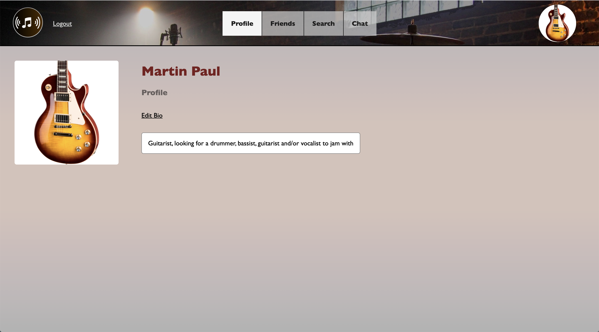
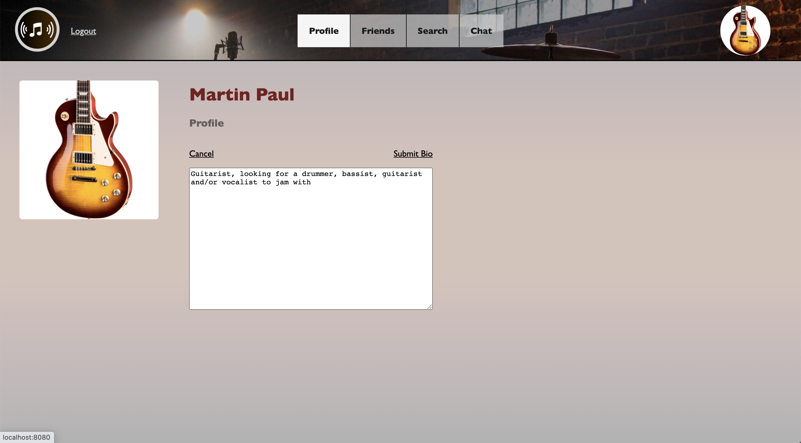
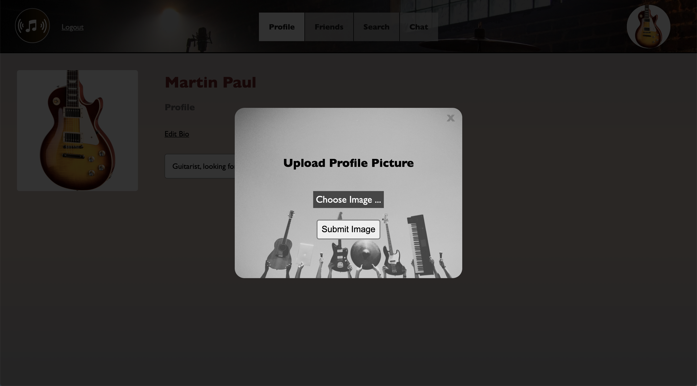
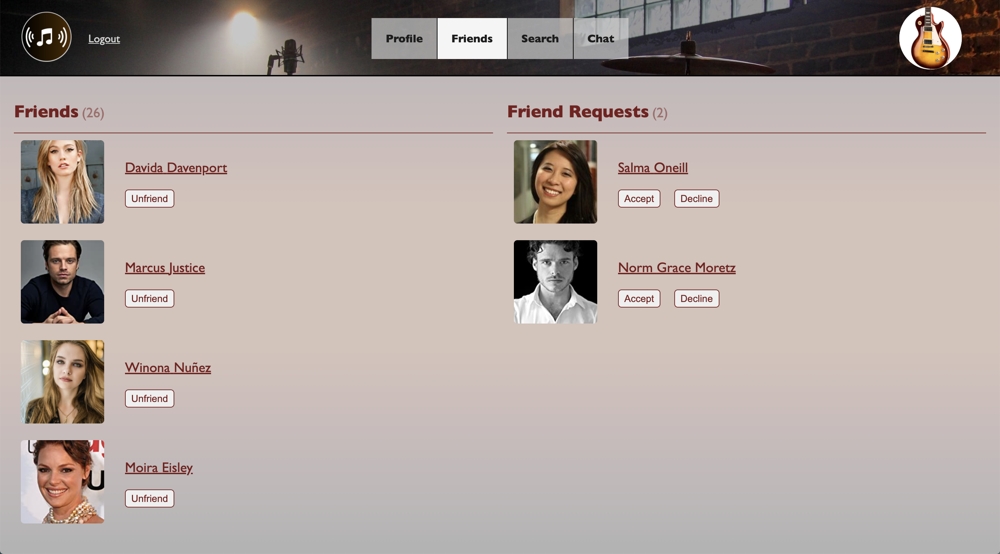
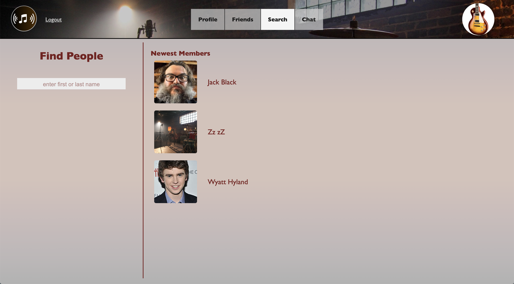
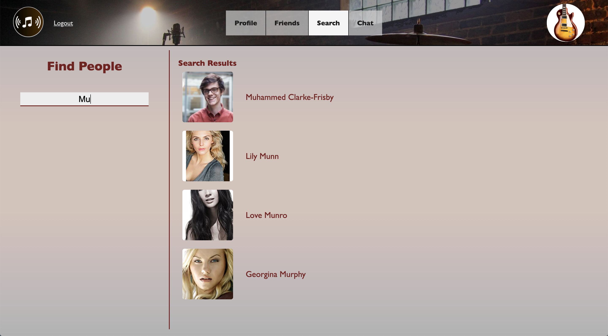
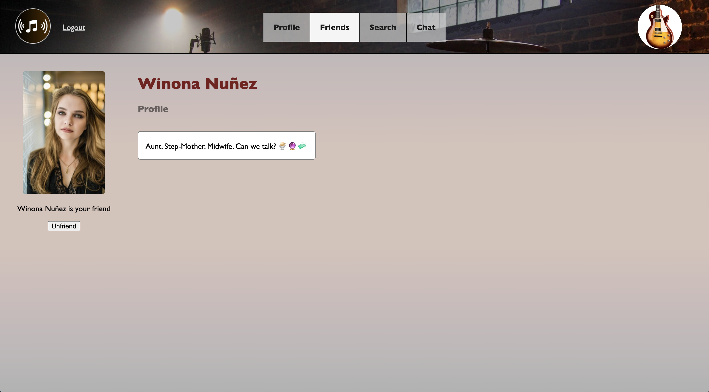
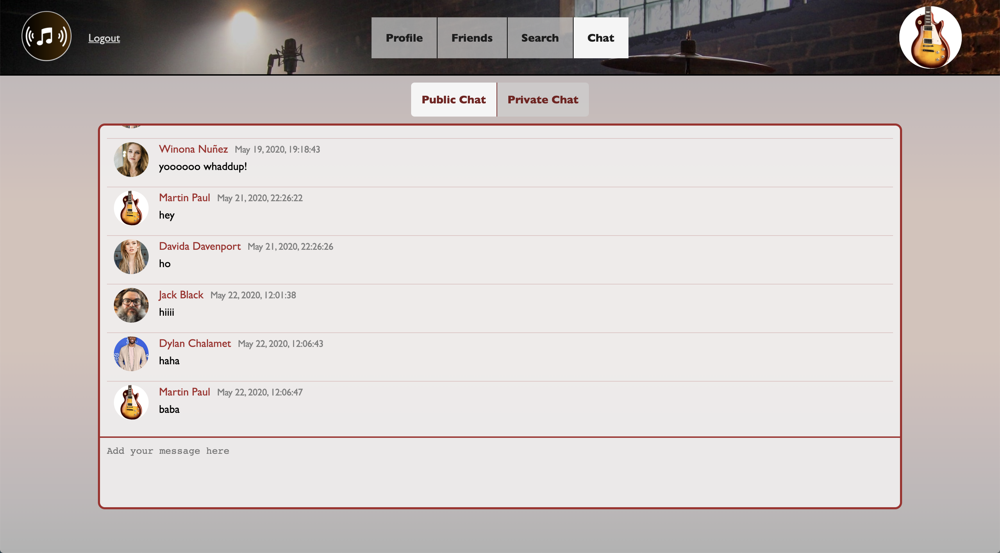
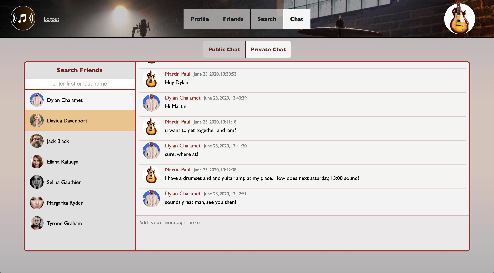
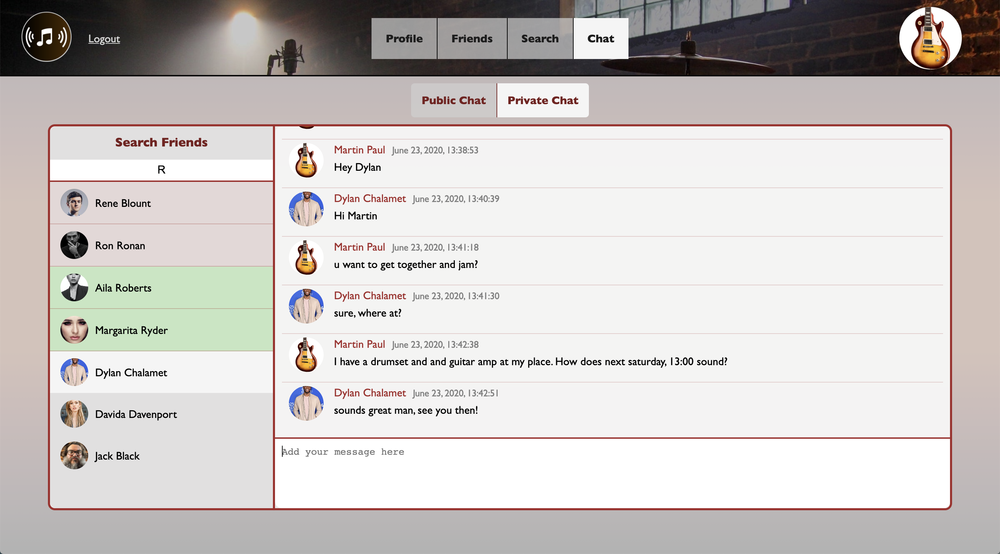

# Social Network - amJam

A musician-oriented social network for casual/amateur musicians to meet up and organize jam-sessions. This is a single-page React.js web application.

## Features

-   Welcome Page
    -   Register/login
    -   Reset password - receive email with code that allows you to change your account password
    -   Form validation - error messages for various scenarios (e.g. missing inputs for any field, duplicate email registration attempt, wrong password at login, etc.)
-   Profile Page
    -   Upload profile picture
    -   Create personal bio on profile-page
-   Friends Page
    -   Shows current friends, and pending friendrequests to you
    -   Accept/decline/end friendships
-   Search Page
    -   Before search: shows 3 most recently joined members
    -   Search by first or last name
    -   Click on search result to view other user's profile page and make friend-request
-   Friendships with other users
    -   send friendrequest
    -   cancel sent friendrequest
    -   accept/decline friendrequest
    -   unfriend
-   Chat Page
    -   Public chat - chat with anyone who is currently logged in
    -   Private chat
        -   view all your private chats (organized by most recently chatted with)
        -   search among your friends and start chat
        -   red/green highlight on search-result to indicate whether or not you currently have an active chat with friend
        -   real time orange-highlight notification for when friend, whose chat window you currently are not in, sends you a message

## Tech Stack

-   JavaScript
    -   React
    -   Redux
    -   Node.js
    -   Express
    -   Socket.IO - for live-chat
-   Amazon Web Services - for storing the uploaded images and sending password-reset email
-   PostgreSQL - for storing
    -   user info (first- last name, email, hashed password, bio, profile picture url)
    -   friendships (active, pending)
    -   chat messages (public, private)
-   HTML
-   CSS

## Screenshots

### Profile Page

### Friends Page

### Search Page

### Chat Page

-   Public Chat
    

-   Private Chat
    -   Chatting with Dylan, Davida just sent me a message (orange highlight)
        
    -   Searching among friends (green: already chatting, red: no active chat)
        

### Welcome Page

-   Register
    
-   Login
    
-   Reset Password
    
-   Error Message (on register page)
    
